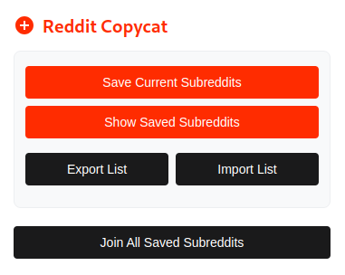

# Reddit Copycat 🚀

*A Chrome extension that simplifies the process of transferring your subreddit subscriptions between Reddit accounts.* 🔄

  
  
Screenshot of the extension in action

---

## ✨ Features

- 💾 Saves your current subreddit subscriptions locally
- ➕ Automatically joins all saved subreddits on a new account
- 🎨 Simple and easy-to-use popup interface
- 🌐 Works with any Reddit account

## 📥 Installation

### Chrome Web Store (Recommended)
1. Visit the [Chrome Web Store](https://chromewebstore.google.com/detail/reddit-copycat/dlbgdjjfgmdobjcjdlohjfgmkeljeegp?authuser=3&hl=en)
2. Click "Add to Chrome"
3. Follow the installation prompts

### Manual Installation (Developer Mode)
1. Clone this repository or download the ZIP file
2. Open Chrome and go to `chrome://extensions/`
3. Enable "Developer mode" in the top right
4. Click "Load unpacked" and select the extension directory

## 🚀 Usage

1. Log in to your old Reddit account
2. Click the extension icon and press "Save Current Subreddits"
3. Log out and log in to your new Reddit account
4. Click the extension icon and press "Join Saved Subreddits"

## 🛠️ How It Works

The extension uses a content script to interact with Reddit. It:
- 🔍 Retrieves your current subreddit subscriptions
- 💾 Saves the subscriptions locally
- ➕ Automatically joins the saved subreddits on a new account

## 👨‍🦱 Author

Created with ❤️ by [S4lXLV](https://github.com/S4lXLV)

---

### Support the Project

If you find this extension helpful, consider buying me a coffee! ☕

